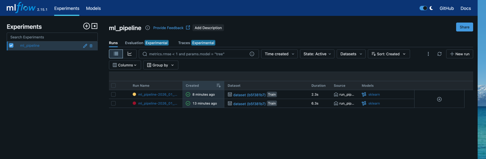
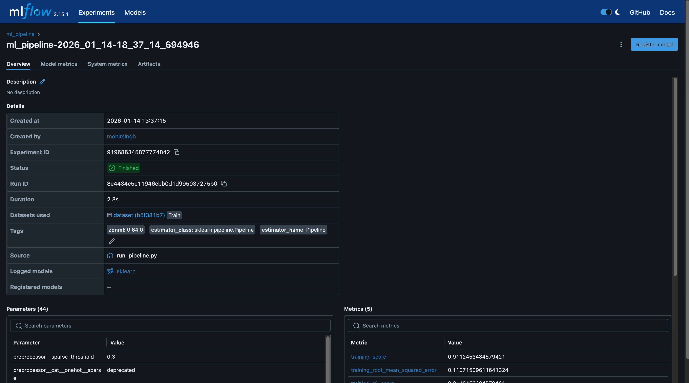
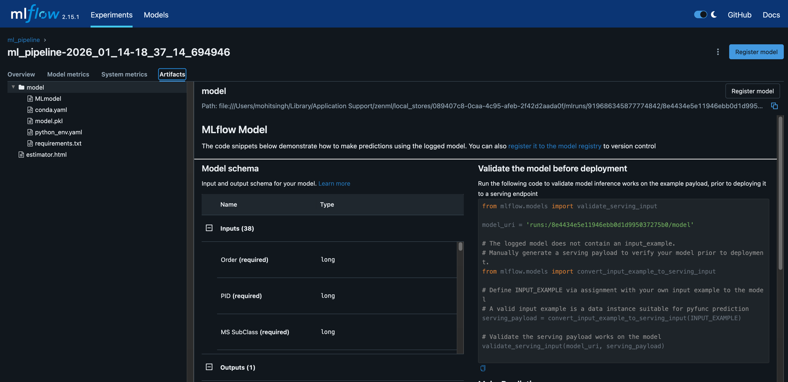

# House Prices Predictor System

An end-to-end machine learning pipeline for predicting house prices using ZenML and MLflow.

## Overview

This project implements a production-grade ML pipeline that:
- Ingests and preprocesses housing data
- Handles missing values and outliers
- Engineers features using log transformations
- Trains a Linear Regression model
- Tracks experiments with MLflow

## Pipeline Architecture

The pipeline consists of 7 steps:

1. **Data Ingestion** - Load housing data from archive
2. **Handle Missing Values** - Fill missing values using mean imputation
3. **Feature Engineering** - Apply log transformation to selected features
4. **Outlier Detection** - Remove outliers using Z-score method
5. **Data Splitting** - Split into train/test sets
6. **Model Building** - Train Linear Regression with sklearn pipeline
7. **Model Evaluation** - Calculate MSE and R-Squared metrics

## Results

- **R-Squared**: 0.922
- **Mean Squared Error**: 0.011

## Screenshots

### MLflow Experiments


### Run Details


### Model Metrics


## Installation

```bash
# Clone the repository
git clone <your-repo-url>
cd prices-predictor-system

# Create virtual environment
python3 -m venv venv
source venv/bin/activate

# Install dependencies
pip install -r requirements.txt

# Initialize ZenML with MLflow
zenml init
zenml experiment-tracker register mlflow_tracker --flavor=mlflow
zenml stack register mlflow_stack -a default -o default -e mlflow_tracker --set
```

## Usage

### Run the Training Pipeline

```bash
source venv/bin/activate
python run_pipeline.py
```

### View Experiment Results

```bash
mlflow ui --backend-store-uri "$(python -c "from zenml.integrations.mlflow.mlflow_utils import get_tracking_uri; print(get_tracking_uri())")"
```

Then open http://127.0.0.1:5000 in your browser.

### Run Deployment

```bash
python run_deployment.py
```

### Make Predictions

```bash
python sample_predict.py
```

## Project Structure

```
prices-predictor-system/
├── data/                   # Raw data files
├── pipelines/              # ZenML pipeline definitions
├── steps/                  # Individual pipeline steps
├── src/                    # Core source code
├── analysis/               # Data analysis scripts
├── screenshots/            # Documentation images
├── run_pipeline.py         # Main training script
├── run_deployment.py       # Deployment script
├── sample_predict.py       # Prediction example
└── requirements.txt        # Python dependencies
```

## Tech Stack

- **ZenML** - ML pipeline orchestration
- **MLflow** - Experiment tracking and model registry
- **scikit-learn** - Machine learning algorithms
- **pandas** - Data manipulation
- **NumPy** - Numerical computing

## License

Apache 2.0
# price-predictor
